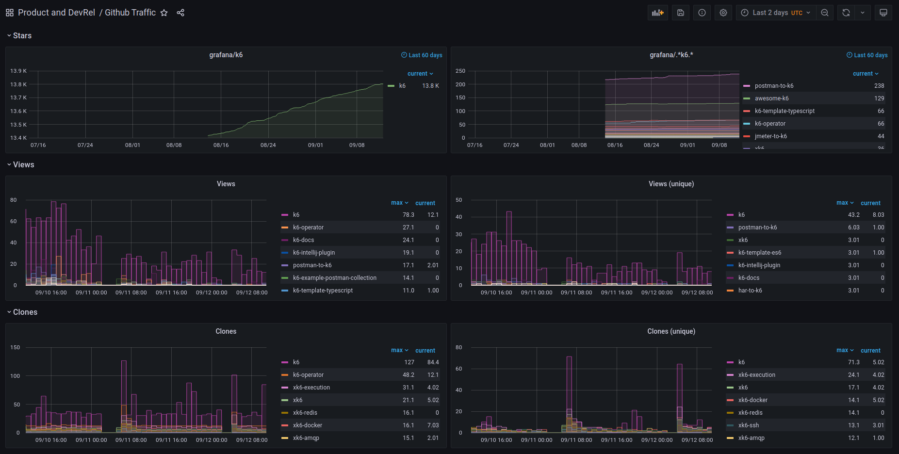

# github-traffic
Github Traffic collects your repository's traffic data and exposes it as Prometheus metrics.


*Grafana dashboard that displays the metrics generated by Github Traffic.*

## Quickstart

Requirements:
- Docker >= 20.10.3

To run **github-traffic** locally you've to create a `.env` file like this one:

```sh
$ cat .env
# Required
GITHUB_TOKEN=your-github-token-goes-here
ORG_NAME=the-name-of-your-organization-goes-here
# Optional
REPO_TYPE=public-or-private # Default: public
REPO_NAME_CONTAINS=string-to-match-repositories-with # Default: ""
CRONTAB_SCHEDULE=crontab-schedule-to-get-data-from-github # Default: "0 * * * *"
```

**_NOTE:_** You also can use your username if you don't belong to any organization. In this case, use "USERNAME" instead of "ORG_NAME".

Run the image:
```
$ docker run --env-file .env -it -p 8001:8001 ghcr.io/grafana/github-traffic
level=INFO msg="Github traffic is running!" 
level=INFO msg="Gather insights" repo="k6" views=163 unique_views=90 clones=406 unique_clones=109 stars=13805
level=INFO msg="Gather insights" repo="postman-to-k6" views=3 unique_views=2 clones=1 unique_clones=1 stars=238
level=INFO msg="Gather insights" repo="jmeter-to-k6" views=1 unique_views=1 clones=2 unique_clones=2 stars=44
...
Go to http://localhost:8001/metrics
```
Profit!

Now you can collect those metrics as you would do with any other service. To visualize them, we provide an example/template Grafana dashboard: https://grafana.com/grafana/dashboards/15000

## Docker compose
In addition, a docker-compose.yaml file is provided. This file also run Prometheus and Grafana. 

**_NOTE:_** You've to create the .env file with you configuration. 

Run compose:
```zsh
❯ docker-compose up -d
Creating network "github-traffic_default" with the default driver
Creating github-traffic_traffic_1 ... done
Creating github-traffic_prometheus_1 ... done
Creating github-traffic_grafana_1    ... done
```

Now, you can access to:
* Grafana: http://localhost:3000
* Prometheus: http://localhost:9090
* Github traffic:  http://localhost:8001

Once you navigate to Grafana (http//localhost:3000), the user and password are admin/admin you have to configure a datasource to Prometheus (http://prometheus:9090) and import the dashboard with id 15000. 