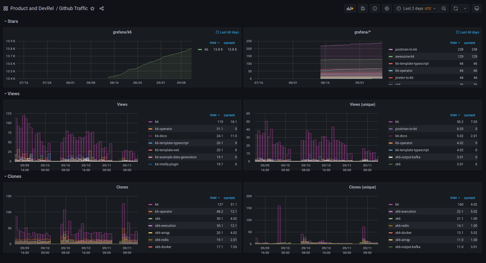

# github-traffic
Github Traffic collects your repository's traffic data and exposes it as Prometheus metrics.


*Grafana dashboard that displays the metrics generated by Github Traffic.*

## Quickstart

Requirements:
- Docker >= 20.10.3

To run **github-traffic** locally you've to create a `.env` file like this one:

```sh
$ cat .env
# Required
GITHUB_TOKEN=your-github-token-goes-here
ORG_NAME=the-name-of-your-organization-goes-here
# Optional
REPO_TYPE=public-or-private # Default: public
REPO_NAME_CONTAINS=string-to-match-repositories-with # Default: ""
CRONTAB_SCHEDULE=crontab-schedule-to-get-data-from-github # Default: "0 * * * *"
```

Run the image:
```
$ docker run --env-file .env -it -p 8001:8001 loadimpact/github-traffic
...
Go to http://localhost:8001/metrics
```
Profit!

Now you can collect those metrics as you would do with any other service. To visualize them, we provide an example/template Grafana dashboard: https://grafana.com/grafana/dashboards/15000

